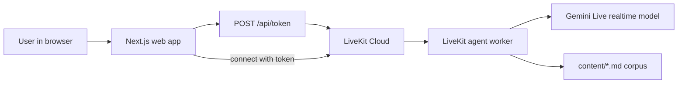

# Conversational CV LiveKit Spec

This document explains how the current repo works in depth:
- product intent
- runtime pieces
- request/audio flow
- grounding strategy
- cloud responsibilities
- failure modes
- extension points

It is deliberately more detailed than [README.md](/Users/johncosnett/PycharmProjects/conversational-cv-livekit/README.md).

## 1. Product intent

This project is an interactive voice-based CV for Conor Cosnett.

The goal is not a theatrical "AI clone". The goal is a practical hiring
artifact: a recruiter, founder, or engineer can ask conversational questions
about Conor's background and hear grounded answers in first person.

Target questions:
- Who are you?
- What did you do at Compass?
- What did you do at Wolfram?
- What roles are you looking for?
- What are your strongest technical skills?

Core product principles:
- grounded, not improvisational
- professional, not gimmicky
- voice-first, but still usable with typed follow-ups
- fast to iterate on with local content files

## 2. Stack at a glance

The repo has five important moving parts:
1. Next.js app
2. LiveKit token endpoint
3. LiveKit agent worker
4. Gemini Live realtime model
5. Local markdown corpus in `content/`

Translated into responsibilities:
- Next.js owns page rendering and token minting
- LiveKit Cloud owns rooms, transport, and agent dispatch
- Gemini Live owns realtime generation
- `agent/` owns persona, tools, and grounding behavior
- `content/` owns factual source material

## 3. High-level architecture

Happy-path summary:
1. browser asks Next.js for a LiveKit token
2. browser joins a fresh LiveKit room
3. LiveKit dispatches the named agent worker
4. worker opens a Gemini Live session
5. model answers using prompt + tool calls into the local corpus
6. audio and transcript stream back into the browser

## 4. Repo map

Key files:
- [intention.md](/Users/johncosnett/PycharmProjects/conversational-cv-livekit/intention.md): product brief
- [cloud.md](/Users/johncosnett/PycharmProjects/conversational-cv-livekit/cloud.md): env, deployment, runtime ops
- [app/page.tsx](/Users/johncosnett/PycharmProjects/conversational-cv-livekit/app/page.tsx): homepage entry
- [app/components/Call.tsx](/Users/johncosnett/PycharmProjects/conversational-cv-livekit/app/components/Call.tsx): main UI and browser session logic
- [app/api/token/route.ts](/Users/johncosnett/PycharmProjects/conversational-cv-livekit/app/api/token/route.ts): LiveKit token minting
- [agent/main.mjs](/Users/johncosnett/PycharmProjects/conversational-cv-livekit/agent/main.mjs): worker bootstrap
- [agent/assistant.mjs](/Users/johncosnett/PycharmProjects/conversational-cv-livekit/agent/assistant.mjs): persona + tools
- [agent/corpus.mjs](/Users/johncosnett/PycharmProjects/conversational-cv-livekit/agent/corpus.mjs): chunking + retrieval
- [content/profile.md](/Users/johncosnett/PycharmProjects/conversational-cv-livekit/content/profile.md): identity, strengths, role preferences
- [content/experience.md](/Users/johncosnett/PycharmProjects/conversational-cv-livekit/content/experience.md): detailed role history
- [content/faq.md](/Users/johncosnett/PycharmProjects/conversational-cv-livekit/content/faq.md): curated recruiter/interviewer answers

Legacy file:
- [lib/grounding.ts](/Users/johncosnett/PycharmProjects/conversational-cv-livekit/lib/grounding.ts)

`lib/grounding.ts` is not used by the current LiveKit path. It looks like an
older grounding approach that injected the whole corpus directly into session
context rather than exposing search tools.

## 6. Frontend runtime

The homepage is tiny. [app/page.tsx](/Users/johncosnett/PycharmProjects/conversational-cv-livekit/app/page.tsx) just renders the `Call`
component. The real browser logic lives in
[app/components/Call.tsx](/Users/johncosnett/PycharmProjects/conversational-cv-livekit/app/components/Call.tsx).

`Call.tsx` does four jobs:
1. start/end a LiveKit session
2. show agent/session status
3. render transcript messages
4. allow typed follow-up prompts

### 6.1 Browser session setup

The page creates:
- `TokenSource.endpoint("/api/token")`

Then passes that into:
- `useSession(tokenSource, { agentName })`

Meaning:
- the browser does not store a long-lived token
- it requests one from the server when needed
- it explicitly asks for the configured agent by name

### 6.2 LiveKit React hooks

The UI uses:
- `useSession(...)`
- `useAgent(session)`
- `useSessionMessages(session)`
- `useAudioPlayback(session.room)`

What these hooks provide:
- connection state
- agent state like `initializing`, `thinking`, `speaking`, `listening`
- transcript messages
- audio playback control for autoplay-restricted browsers

### 6.3 Start conversation button

The start button calls `handleClick`.

If disconnected:
- `session.start()`

If connected:
- `session.end()`

So the first click:
1. hits `/api/token`
2. receives a room token
3. joins LiveKit
4. triggers agent dispatch
5. waits for the worker to greet the user

### 6.4 Typed message path

The transcript area also doubles as a text fallback.

On typed submit:
1. trim the input
2. if session not started, call `session.start()`
3. call `send(value)`
4. LiveKit forwards that message into the active session
5. agent answers through the same voice/text channel

### 6.5 Transcript and audio playback

Transcript rendering is intentionally simple:
- local user messages: dark bubbles
- remote assistant messages: green bubbles

Audio playback is handled by:
- `RoomAudioRenderer room={session.room}`

If the browser blocks autoplay, the page shows:
- `Enable audio`

## 7. Token endpoint

The token route is
[app/api/token/route.ts](/Users/johncosnett/PycharmProjects/conversational-cv-livekit/app/api/token/route.ts).

Its job is narrow:
- validate required env vars
- create a random participant identity
- create a random room name
- mint a short-lived LiveKit JWT
- return connection details to the browser

### 7.1 Why it exists

The browser cannot safely hold your LiveKit API secret.

So the server creates the JWT using:
- `AccessToken`
- `VideoGrant`

### 7.2 What the token grants

The minted token allows:
- room join
- publish
- publish data
- subscribe

Token TTL:
- `15m`

### 7.3 Room strategy

Each session gets a fresh random room like:
- `cv-room-1234`

Implications:
- stateless sessions
- easy local iteration
- no persistent memory across refreshes or separate rooms

## 8. Agent worker

The worker entrypoint is
[agent/main.mjs](/Users/johncosnett/PycharmProjects/conversational-cv-livekit/agent/main.mjs).

This process is separate from Next.js.

That separation matters:
- Next.js serves the site and token endpoint
- the worker registers with LiveKit as an agent runtime

Locally, both processes must run:
- `npm run dev`
- `npm run agent:dev`

### 8.1 Worker startup

At startup the worker:
1. loads `.env.local` via `dotenv`
2. sets the LiveKit agent name
3. builds a Gemini realtime model
4. registers the worker with `cli.runApp(...)`

The important model line is:
- `new google.beta.realtime.RealtimeModel(...)`

That `beta.realtime` path matters. The installed package version does not
expose the realtime model on `google.realtime`.

### 8.2 Model defaults

Current defaults in [agent/main.mjs](/Users/johncosnett/PycharmProjects/conversational-cv-livekit/agent/main.mjs):
- model: `gemini-2.5-flash-native-audio-preview-12-2025`
- voice: `Puck`

Reason for this choice:
- it supports Gemini Live realtime audio
- it works with `generateReply(...)`
- it avoided the runtime failures hit during setup

### 8.3 Greeting behavior

After starting the session, the worker explicitly calls:
- `session.generateReply(...)`

That forces an opening greeting so the experience feels conversational
immediately instead of waiting silently for the user to speak first.

## 9. Persona and tool layer

The actual assistant behavior lives in
[agent/assistant.mjs](/Users/johncosnett/PycharmProjects/conversational-cv-livekit/agent/assistant.mjs).

This file defines:
- system instructions
- tool schemas
- tool implementations
- the high-level answer style

### 9.1 Prompt responsibilities

The system prompt does real product work. It:
- forces first-person answers as Conor
- frames the app as a professional hiring artifact
- discourages gimmick roleplay
- prefers concise voice-friendly answers
- forbids inventing facts
- pushes the model toward tool use for factual lookup

Without that prompt discipline, the model could sound plausible while drifting
away from the actual CV.

### 9.2 Tools

Two tools are exposed:
- `corpusOverview`
- `searchCvCorpus`

What they do:
- `corpusOverview`: lists available headings/sources
- `searchCvCorpus`: returns top matching grounded source chunks

Why tools instead of one giant prompt:
- better factual lookup at answer time
- easier corpus evolution
- less need to keep the whole corpus in every prompt
- more honest answers when something is missing

## 10. Grounding layer

Grounding lives in
[agent/corpus.mjs](/Users/johncosnett/PycharmProjects/conversational-cv-livekit/agent/corpus.mjs).

This layer is intentionally simple:
- no vector DB
- no embeddings
- no external retrieval service

### 10.1 Corpus files

The agent currently reads:
- `content/profile.md`
- `content/experience.md`
- `content/faq.md`

These are the factual backbone of the app. If the answers feel weak, editing
these files is the fastest improvement path.

### 10.2 Chunking strategy

The loader:
- reads each markdown file
- splits on blank lines
- tracks the nearest heading
- stores source, heading, raw text, normalized text

Each chunk looks roughly like:
- source file
- heading label
- paragraph text
- normalized text for matching

### 10.3 Search strategy

Retrieval is lexical, not semantic.

The ranking logic:
1. normalize the query
2. split into tokens
3. score each chunk for token overlap
4. add bonus score for full-query inclusion
5. return top matches

Benefits:
- transparent
- cheap
- no extra infra
- easy local debugging

Limitations:
- weak synonym handling
- weak semantic recall
- wording-sensitive

### 10.4 Corpus caching

`getCorpusChunks()` caches the corpus promise in-process.

Implication:
- if you edit `content/*.md`, restart the worker to guarantee fresh answers

## 11. Full request and audio flow

Happy path for a fresh session:
1. user opens homepage
2. `CallUI` renders
3. user clicks `Start conversation`
4. browser calls `/api/token`
5. server returns:
   - `serverUrl`
   - `roomName`
   - `participantName`
   - `participantToken`
6. browser joins the LiveKit room
7. LiveKit sees the requested `agentName`
8. LiveKit dispatches the registered worker
9. worker starts a Gemini Live session
10. worker mounts `ConversationalCvAgent`
11. worker triggers `generateReply(...)`
12. Gemini begins generating audio + transcript text
13. LiveKit carries that audio/text back to the browser
14. `RoomAudioRenderer` plays remote audio
15. transcript messages render through `useSessionMessages`
16. user asks follow-up by voice or by typed text
17. model may call `searchCvCorpus`
18. tool returns grounded chunks
19. model answers in first person using those chunks

Cloud/runtime ops are covered in
[cloud.md](/Users/johncosnett/PycharmProjects/conversational-cv-livekit/cloud.md).

## 13. Why this architecture fits the project

This setup works well for a conversational CV because it optimizes for:
- quick MVP speed
- grounded answers
- clean separation of concerns
- easy content edits
- voice-first UX without hand-rolling WebRTC

It is not the most elaborate architecture possible. It is a sensible one.

## 14. Current limitations

Known limitations:
- no persistent memory across sessions
- current voice is a Gemini preset, not a cloned Conor voice
- retrieval is keyword-based, not embedding-based
- content changes require worker restart because corpus loading is cached
- no recruiter/founder/interviewer mode toggle yet
- no explicit source-citation UI yet

One implementation nuance:
- logs show LiveKit auto-connecting through job context before the explicit
  `ctx.connect()` call in [agent/main.mjs](/Users/johncosnett/PycharmProjects/conversational-cv-livekit/agent/main.mjs)
- the current setup works, but that is worth revisiting if the worker gets more
  complex

## 16. Best improvement paths

Highest-leverage next steps:
1. deepen `content/*.md`
2. add more project-specific FAQ entries
3. add recruiter / founder / interviewer modes
4. add source attribution in the UI
5. replace lexical search with hybrid or embedding retrieval
6. add post-call summaries
7. add persistent memory if needed
8. add a closer-to-Conor output voice later

## 17. Mental model

One sentence:

This repo is a thin Next.js shell around a LiveKit-dispatched Gemini Live agent
whose answers are grounded by two local tools over a small markdown CV corpus.

One paragraph:

The browser joins a fresh LiveKit room using a short-lived token from Next.js.
LiveKit dispatches a Node worker that spins up a Gemini Live realtime session.
That worker mounts a voice agent with instructions and two grounding tools. The
tools read and search a small markdown corpus describing Conor's background,
experience, and FAQ-style answers. Audio and transcript flow back through
LiveKit into the browser. The result is an interactive voice CV with grounded,
first-person answers and very little infrastructure beyond Next.js, LiveKit,
Gemini, and local markdown files.
